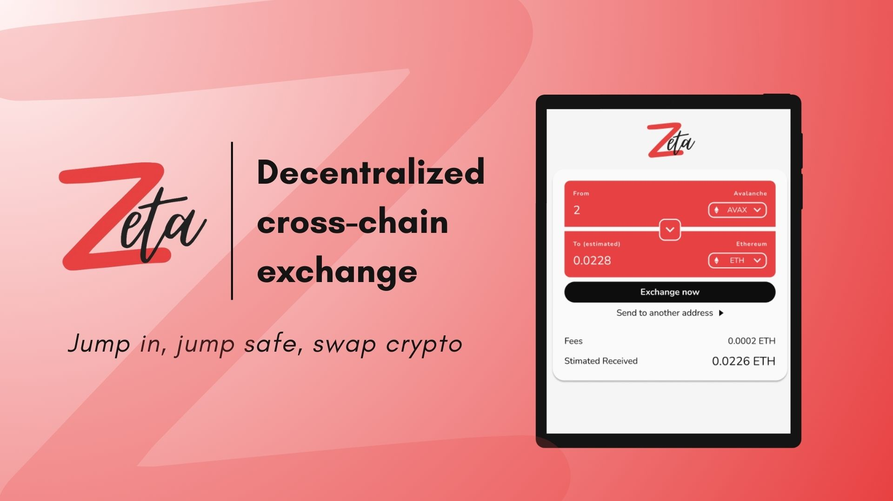
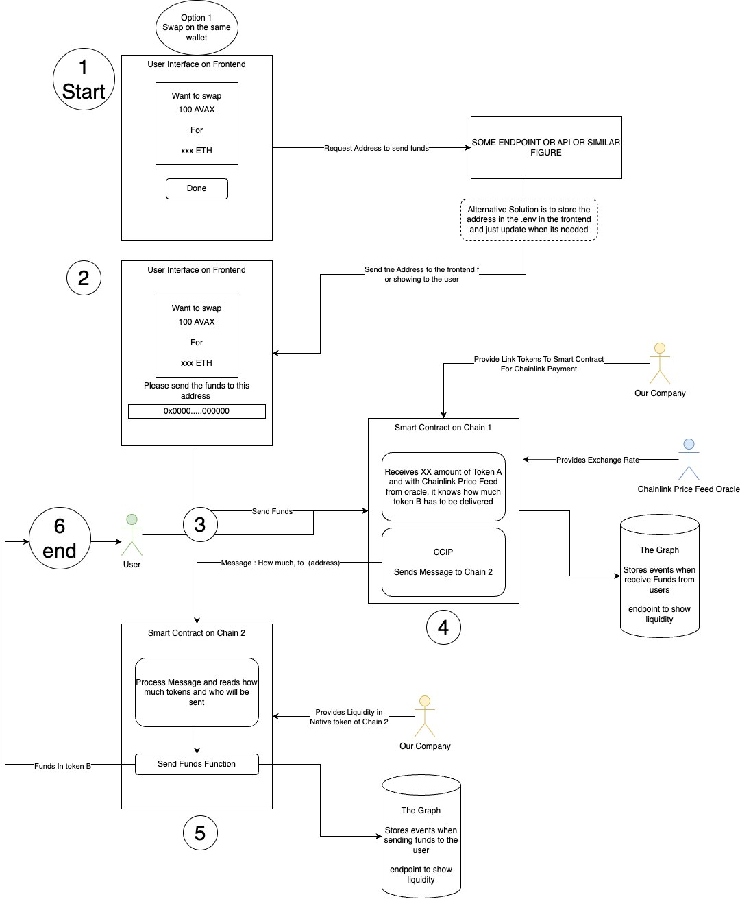

[![Contributors][contributors-shield]][contributors-url]
[![Forks][forks-shield]][forks-url]
[![Stargazers][stars-shield]][stars-url]
[![Issues][issues-shield]][issues-url]
<!-- [![MIT License][license-shield]][license-url] -->

<!-- PROJECT INTRO -->

 

  

 <h3 align="center"> Jump in, jump safe, swap crypto 📍</h3>
  

  [Chainlink Constellation Hackathon](https://chain.link/hackathon)

  
    <a href="https://zeta-d-app-zeta-labs.vercel.app/"><strong>Test Zeta »</strong></a>
     
    <a href="https://youtu.be/F6dXKxEcLqA">View Demo</a>
    ·
    <a href="https://github.com/ConstellationHackathon">Report Bug</a>
    ·
    <a href="https://github.com/ConstellationHackathon">Request Feature</a>
  

 

<!-- ABOUT THE PROJECT -->

# About The Project

 

  
[![Product Name Screen Shot][product-screenshot]](https://youtu.be/F6dXKxEcLqA?si=FP9LwJrPWqA2neM9)

  

Zeta is a cryptocurrency exchange that allows you to jump between different blockchain networks easily and securely. With Zeta, you don't need KYC or intermediaries. You only need to indicate which wallet you want to receive your money in, without connecting your wallet and exposing yourself to security risks. Zeta is the ideal platform for users who want to take advantage of the opportunities of cryptocurrencies, regardless of their level of experience or knowledge. Zeta is the easiest jump.

>[Click to test Zeta](https://zeta-d-app-zeta-labs.vercel.app/)

The entire process is outlined in the following diagram: 

  

 

## Process Explanation:

**1. User Initiation:**

Users seamlessly transfer their funds between different blockchain networks (e.g., Avax to Ethereum), ensuring a secure and private experience. By avoiding the need to connect their wallets, users benefit from increased security and privacy. Additionally, they receive the most competitive rate available through our fedge pricing system.

**2. User Transaction:**

To initiate a transaction, user send funds to the provided address and subsequently fill up the info of the sending wallet address. This allows Zeta to connect the user's action with the relevant on-chain smart contract, ensuring a smooth and efficient transaction process.

**3. On-chain Smart Contract (Price Feed + CCIP):**

Upon receiving the designated amount of token A, the smart contract leverages Chainlink Price Feed from the oracle to determine the equivalent amount of token B to be delivered. This information is then relayed to Chain II through Cross-Chain Interoperability Protocol (CCIP) messaging.

**4. On-chain Smart Contract II (Price Feed + CCIP):**

The smart contract on Chain II processes the received message, extracts the intended recipient and token amount, and initiates the token B sending function. This ensures the seamless and accurate execution of the cross-chain transaction.

**5. Transaction**

The Graph platform records all transaction events, including user funds received, providing an endpoint for displaying liquidity and execution details. While this information is readily available, user access is optional and does not impact the transaction flow.

**Note:** During the MVP phase of this project, Zeta acts as the sole liquidity provider. All transactions will be executed upon user initiation and confirmation.

> Click to see Zeta Demo bellow
  
[![Product Name Screen Shot][product-screenshot]](https://youtu.be/F6dXKxEcLqA?si=FP9LwJrPWqA2neM9)

(<a href="#readme-top">back to top</a>)

# Built With

[![Chainlink][chainlink]]()

## Zeta's Participation in the Constellation Hackathon and Built With Technologies

Zeta, as cross-chain exchange, is excited to participate in the Constellation Hackathon. We are including a variety of innovative technologies, such as:

## Chainlink: 

- **Data Feeds:** Providing oracle price feeds for accurate cross-chain conversions.
- **Cross-Chain Interoperability Protocol (CCIP):** Facilitating secure and seamless communication between different blockchain networks.

[![Prizes2][prizes2]]()

## Zeta is participating in the following categories:

- **Cross-chain Solutions:** Leveraging our innovative technology to provide a user-friendly cross-chain exchange experience.
- **SocialFi Innovation:** Exploring how Zeta can be used to empower social finance initiatives.
- **DeFi and Payments:** Demonstrating how Zeta can contribute to the growth and adoption of decentralized finance and cross-chain payments.
- **Tech for Good:** Investigating how Zeta can be used to onboard new users and promote financial inclusion in vulnerable regions.
- **Grant Prize:** Competing for funding to further develop and - expand Zeta's capabilities.

[![Prizes][prizes]]()

## Additional Partners:

### Avalanche: 

Providing the infrastructure for receiving and sending funds via the C-Chain, using the Fuji Testnet for this development phase.

[![Avax][avax]]()

### The Graph: 

Integrating with The Graph to create a subgraph that allows users to track their transaction history on-chain, ensuring transparency and peace of mind.

[![Thegraph][thegraph]]()
 

We are excited to showcase our progress and compete for the opportunity to further develop and expand our platform.

(<a href="#readme-top">back to top</a>)

<!-- CONTACT -->

# Zeta Team

Angela Ocando - [@ocandocrypto](https://twitter.com/ocandocrypto) - ocandocrypto@proton.me - PM 
 
Sebastian Guaqueta - [@scguaquetam](https://twitter.com/scguaquetam) - sheva3232@gmail.com - Frontend & Smart Contracts
 
Jonathan Diaz - [@jontdiaz](https://twitter.com/jonthdiaz) - JonthDiaz@gmail.com - Backend 
 
Miguel Angel - [@MAB015](https://twitter.com/MAB015) - miguellangellbol@gmail.com  - UI/UX 
 

(<a href="#readme-top">back to top</a>)

<!-- MARKDOWN LINKS  -->

[contributors-shield]:https://img.shields.io/github/contributors/ConstellationHackathon/zeta-dApp.svg?style=for-the-badge&color=red
[contributors-url]: https://github.com/ConstellationHackathon/zeta-dApp/graphs/contributors

[forks-shield]: https://img.shields.io/github/forks/ConstellationHackathon/zeta-dApp.svg?style=for-the-badge&color=white

[forks-url]: https://github.com/ConstellationHackathon/zeta-dApp/forks

[stars-shield]: https://img.shields.io/github/stars/ConstellationHackathon/zeta-dApp.svg?style=for-the-badge&color=red
[stars-url]: https://github.com/ConstellationHackathon/zeta-dApp/stargazers

[issues-shield]: https://img.shields.io/github/issues/ConstellationHackathon/zeta-dApp.svg?style=for-the-badge&color=white
[issues-url]: https://github.com/ConstellationHackathon/zeta-dApp/issues

<!-- IMAGES -->

[product-screenshot]: product.png
[prizes]: prizes.png
[prizes2]: prizes2.png
[chainlink]: chainlink.jpeg
[avax]: avax.jpeg
[thegraph]: thegraph.jpeg

<!-- Step by step learning and getting better :fire: > -->
